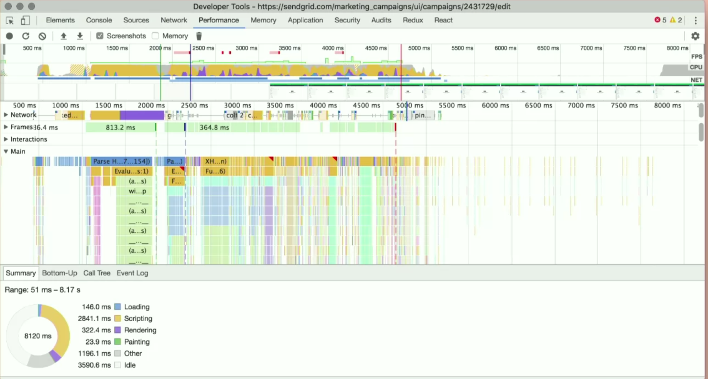

### 01-the-cost-of-Javascript

---

- most of the time when applicaiton is running, it's actually parsing.
  

 
 

# How Javascript is work

- js is compiled language
- most browser use JIT, just in time compilation. js code is compiled moments before it's excuated. on user's machine

## Parsing 
- parsing is slow. 1mb/s in mobile 
- To reduce parsing time , do less code to parse, or parse it later 
- There is 2 way in parsing 
  1. Eager parsing (parsing everying now )
  2. lasy parsing (scan, but purse it later)

  To make everyhign Eager parsing we can wrap our code with 
`(function add() {
    return ""
  })()`

- one way to improve parsing is use lib called `optimize-js`. 
but the problem is if you use it everywhere, that can be a problem. 
as different browser compiler are implemented different way, without measuring the each lib in different browser, that can be slow too 

use this lib to measure compilation `https://nolanlawson.github.io/test-optimize-js/`

- try to avoid nested function 
like 
` function sumOfy(){ 
   function sumOfx(){
    return ""
   }
}`

